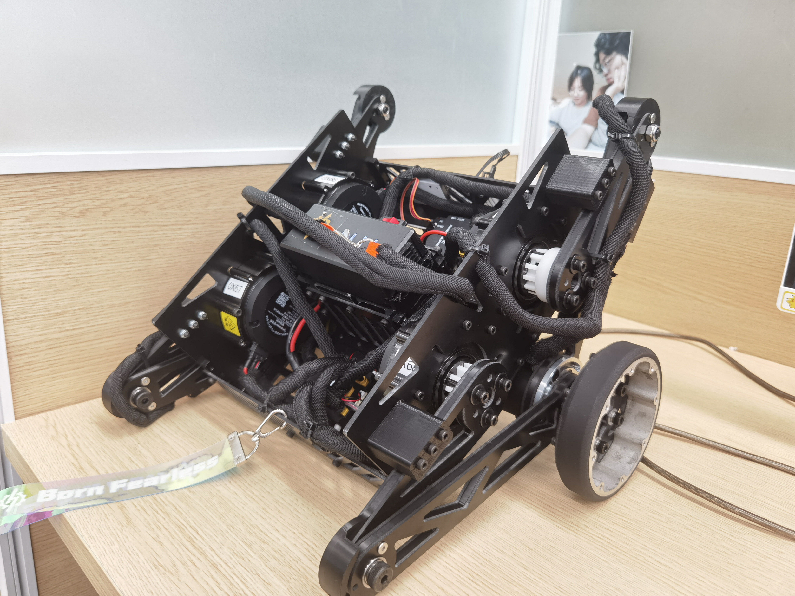
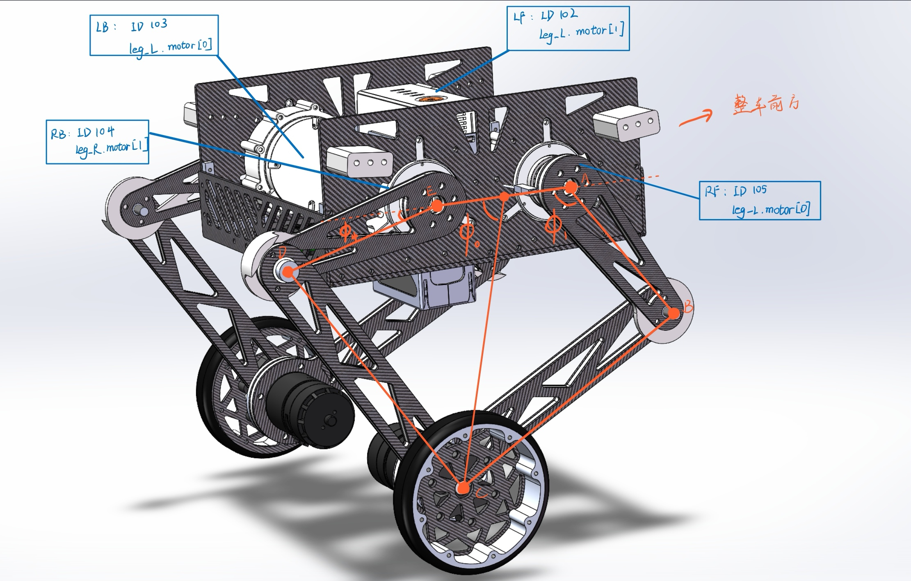
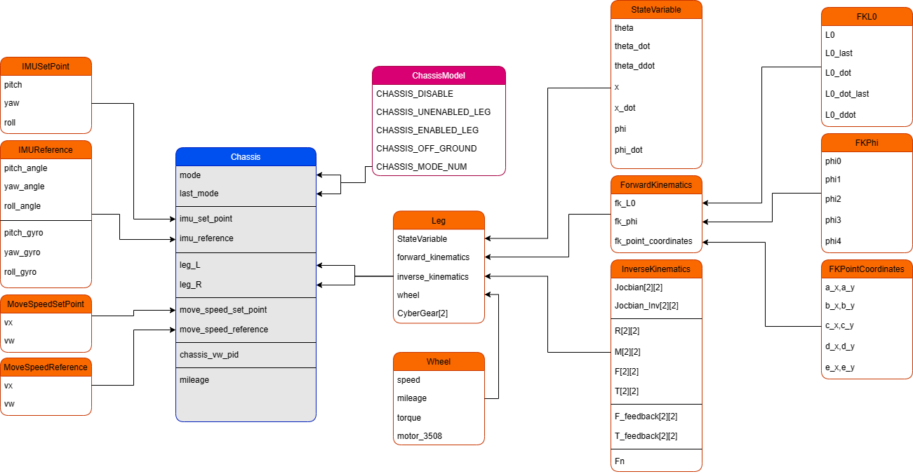
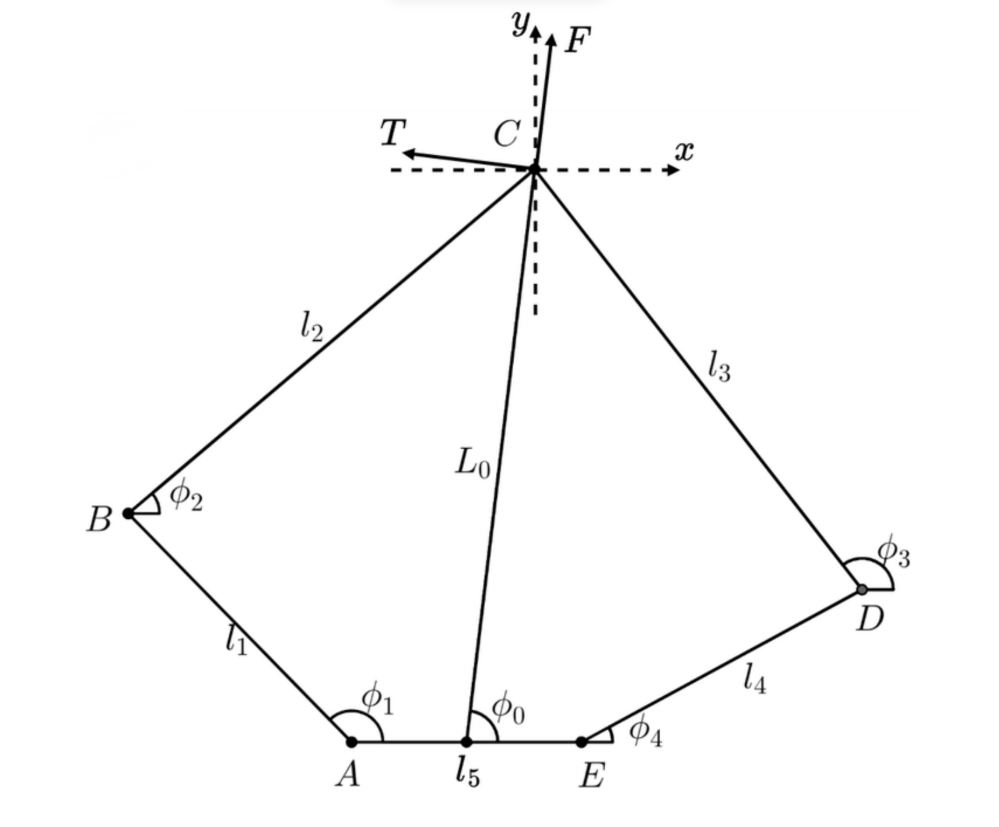

# 轮腿机器人相关图片
## 整车图片

## 正方向定义


## 底盘结构体从属关系


## 五连杆定义


## 机械参数
### 尺寸
L1 = 0.11m   
L2 = 0.18m  
L3 = 0.18m  
L4 = 0.11m  
L5 = 0.09m  
驱动轮半径 Wheel_R = 0.05m  

### 质量
整车 4.635kg  
轮子 0.183kg  
单腿 0.715kg  
车体 2.839kg

# 嵌入式 C 风格指南

本文档用于规定轮腿机器人嵌入式部的C编码规范。

本篇指南基于以下原则编写：

- 易读性 > 运行效率 > 简短

嵌入式组的每一位开发者都应该遵循以上基本约定。

## 目录

- [嵌入式C风格指南](#嵌入式C风格指南)
  - [命名](#命名)
    - [文件夹](#文件夹)
    - [文件](#文件)
    - [宏](#宏)
    - [typedef](#typedef)
    - [结构体](#结构体)
    - [枚举](#枚举)
    - [变量与参数](#变量与参数)
    - [函数](#函数)
  - [格式](#格式)
  - [最佳实践](#最佳实践)

## 命名

任何命名都遵循以下基本原则：

1. 在没有歧义性的前提下保持命名简短。
2. 非必要情况下不增加无意义的前缀或后缀。

### 文件夹

使用大驼峰命名。

```c
// good
Bot
Device
Driver
    
// bad
soc
disk_io
LED
```

### 文件

使用全小写 + 下划线命名法，源文件使用 .c 后缀，头文件使用 .h 后缀。

```c
// good
soc.c
soc_bsp.c
chassis.h
    
// bad
Soc.c
Led_Io.c
RobotState.h
```

### 宏

使用全大写 + 下划线命名法。

```c
// good
SOC_HEARTBEAT_TIMEOUT
DISK_ELEVATE_IDLE_HEIGHT
EPSILON_EQUAL(currant, target, epsilon)
    
// bad
Max(a)
Convert2Long(a)
MinHeadingMeters
```

### typedef

使用全小写 + 下划线命名，并遵循规范 cr_{type_name}\_t，不要对结构体和枚举使用 typedef。

```c
// good
cr_bool_t
cr_int32_t
cr_float32_t
    
// bad
int32
u8
f64
```

### 结构体

结构体名称使用大驼峰命名，且不允许使用 typedef；成员使用全小写 + 下划线命名。

```c
// good
struct DiskOutput {
  enum DiskElevateState disk_elevate_state;
  cr_bool_t is_disk_cut;
};

// bad
typedef struct {
  enum DISK_ELEVATE_STATE disk_elevate_state;
  cr_bool_t disk_cut;
} diskOutput;
```

### 枚举

枚举使用大驼峰命名，且不允许使用 typedef；成员使用全大写 + 下划线命名。

```c
// good
enum DiskElevateState {
  ELEVATE_UP, ELEVATE_STOP, ELEVATE_DOWN
};

// bad
enum diskElevateState {
  elevate_up, elevateStop, ElevateDown
};
```

### 变量与参数

使用全小写 + 下划线命名，以及：

- 对于布尔型变量，使用 is 开头命名变量。

```c
// good
chassis_physical_config
motors
is_allow_chassis_forward
    
// bad
ChassisPhysicalConfig
motorGroup
Is_Allow_Chassis_forward
```

### 函数

使用全小写+下划线命名，以及：

- 对于返回布尔值的函数，使用 is 开头命名。

```c
// good
update_chassis_io_output()
set_chassis_drive(float linear_vel, float angular_vel)
robot_init()
    
// bad
updateChassisIoOutput()
SetChassisDrive(float velA, float velB)
Robot_Init()
```

## 格式

嵌入式开发遵循 Google C++ 的代码排列格式。详情请查看：[Google C++ Style Guide](https://google.github.io/styleguide/cppguide.html)

## 最佳实践

- 通过 getter 和 setter 而不是使用 extern 直接暴露句柄。
- 不要在头文件增加无意义的函数声明。
- 对于私有变量及函数请使用 static 关键字修饰。
- 采用最少 include 原则，只 include 所需的头文件，不要把所有的 include 都在头文件中引入。

